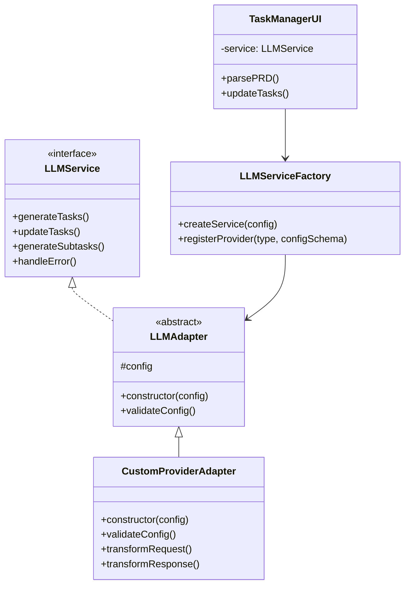
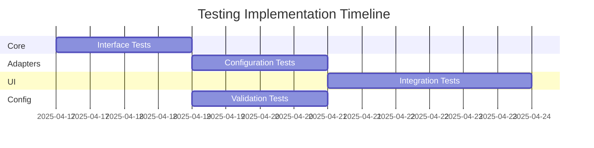

# LLM Provider Abstraction Refactoring Plan

## Current Architecture Assessment

### Strengths
- Functional UI/workflow integration
- Basic multi-provider support
- Clear task processing pipeline

### Pain Points
- Tight coupling between business logic and provider implementations
- Complex fallback mechanisms
- Inconsistent error handling
- Difficult to add new providers
- Testing challenges due to direct SDK dependencies
  - NOTE: Refer to package.json for current test run commands and jest.config.js for current testing setup

## Proposed Architecture

### Vitally Important Note
- Use ES6 modules for all new code
- Avoid CommonJS modules
- DON'T FUCKING USE `require`!
- Use `import` and `export` syntax



## Provider Configuration

```yaml
# Example configuration
providers:
  ollama:
    base_url: "http://localhost:11434"
    model: "llama2"
    temperature: 0.7
    timeout: 30000

  anthropic:
    base_url: "https://api.anthropic.com"
    version: "2023-06-01"
    timeout: 10000
```

## Implementation Phases

### Vitally Important Note!!!!
- Use ES6 modules for all new code
- Avoid CommonJS modules
- DON'T FUCKING USE `require`!
- Use `import` and `export` syntax

### Phase 1: Core Interface & Testing (3 days)
1. Define `LLMService` interface
2. Create contract tests
3. Implement mock service for testing
4. Set up Jest test infrastructure

### Phase 2: Adapter Implementation (5 days)
1. Build abstract `LLMAdapter` base
2. Implement generic `CustomProviderAdapter`
3. Comprehensive unit tests
4. Configuration validation

### Phase 3: UI Integration (4 days)
1. Develop facade layer
2. Compatibility tests
3. Error handling integration
4. Workflow preservation

### Phase 4: Configuration System (3 days)
1. Design config schema
2. Implement validation
3. Environment variable support
4. Migration path

## Migration Approach

1. Convert existing adapters to configuration:
```javascript
// Before
const service = new LLMServiceFactory().createService(
  new AnthropicAdapter(anthropicConfig)
);

// After 
const service = new LLMServiceFactory().createService({
  provider: 'anthropic',
  ...anthropicConfig
});
```

2. Gradual feature migration
3. Phase out old implementation
4. Final cleanup

## Testing Strategy



### Test Coverage Goals
- 100% interface contract coverage
- 90%+ configuration test coverage
- 85%+ integration test coverage
- All error scenarios tested

## Risks & Mitigation
| Risk | Mitigation Strategy |
|------|---------------------|
| Breaking changes | Compatibility layer |
| Performance impact | Benchmark testing |
| Configuration conflicts | Validation system |
| Test coverage gaps | CI enforcement |

### Vitally Important Note, Last Chance!!!
- Use ES6 modules for all new code
- Avoid CommonJS modules
- DON'T FUCKING USE `require`!
- Use `import` and `export` syntax